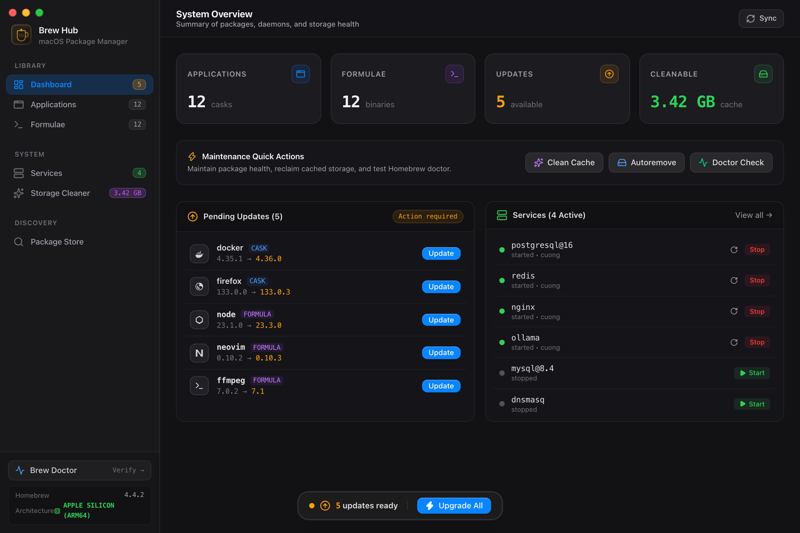
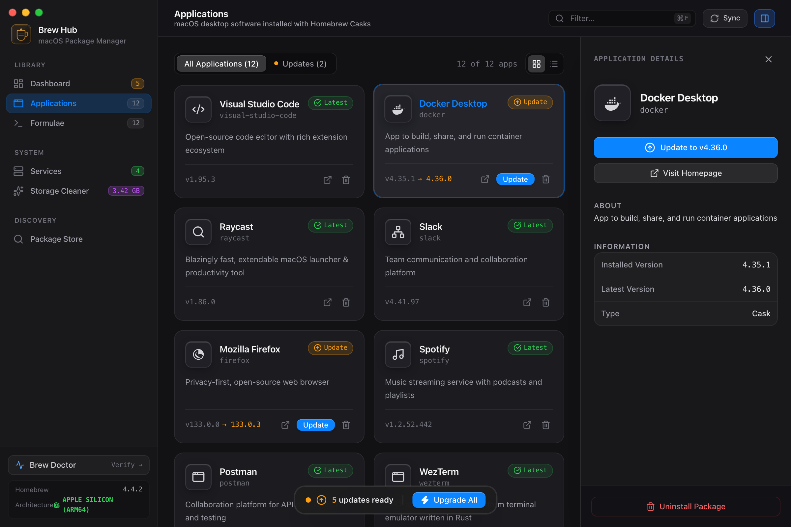
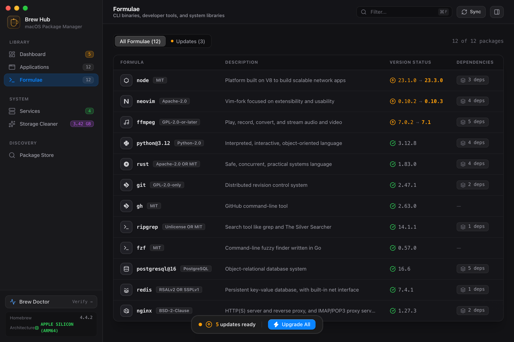
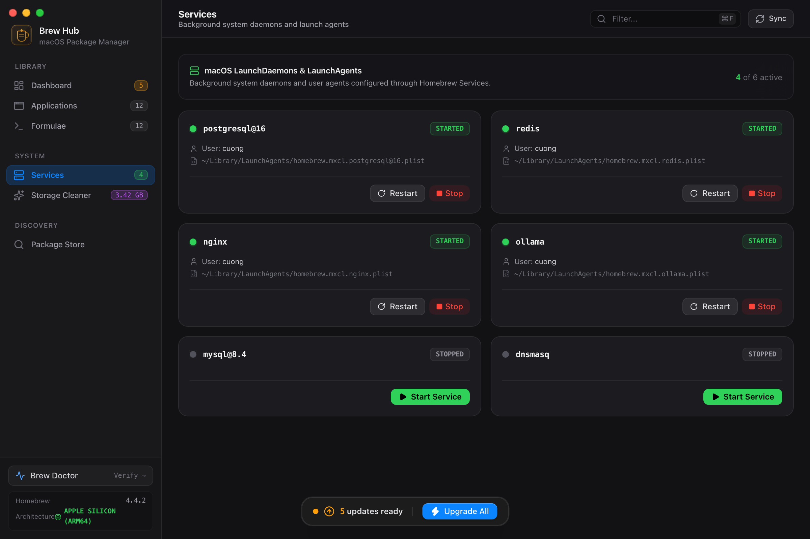
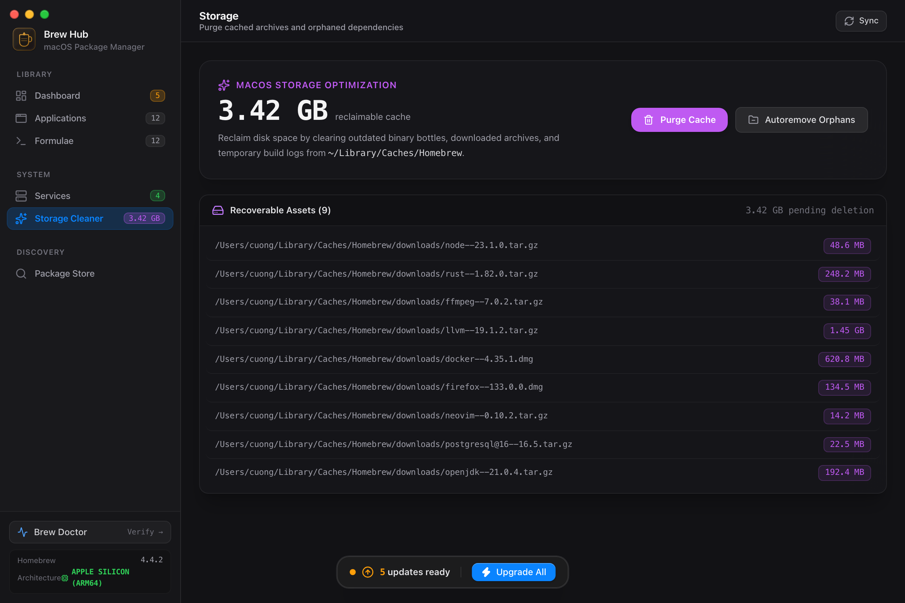

# 🍺 Brew Hub

A modern, high-performance desktop application for managing [Homebrew](https://brew.sh) packages, applications, background services, and disk storage on macOS. Built with **Tauri v2 (Rust)** and **React 19 + TypeScript + Tailwind CSS**.

<p align="center">
  <a href="https://www.paypal.com/ncp/payment/3R9QBM4UJJRSE"></a>
  <a href="https://www.paypal.com/ncp/payment/3R9QBM4UJJRSE"></a>
  <a href="LICENSE"></a>
</p>

<p align="center">
  
</p>

---

## 📸 Screenshots

| Applications & Inspector | CLI Formulae Manager |
|:---:|:---:|
|  |  |

| Background Services Controller | Storage & Cache Cleaner |
|:---:|:---:|
|  |  |

---

## ✨ Features

- 🖥️ **macOS Application Manager (Casks):**
  - View installed desktop applications with live version diffs.
  - One-click app upgrades, homepage exploration, and uninstalls.
- ⚡ **CLI Formulae Manager:**
  - View installed developer tools, packages, and shared libraries.
  - Inspect dependencies, licenses, and installed versions.
  - Fast search and filter for pending updates.
- 🚦 **Background Services Controller:**
  - Monitor live macOS LaunchAgents and LaunchDaemons managed by `brew services`.
  - Instant Start, Stop, and Restart controls with running indicators.
- 🧹 **Storage & Cache Cleaner:**
  - Scan for reclaimable disk space from cached archives, obsolete bottles, and download artifacts.
  - Safe one-click cache purge (`brew cleanup --prune=all`).
  - Autoremove orphaned dependencies (`brew autoremove`).
- 🔍 **Package Explorer & Store:**
  - Search thousands of open-source CLI tools and desktop casks.
  - Install new packages with real-time terminal output logs.
- 🩺 **Brew Doctor Diagnostic:**
  - Run full system diagnostic health checks directly from the app.
- 💻 **Native macOS Aesthetic:**
  - Native translucent window framing, fast start times, and minimal memory footprint thanks to Tauri v2.

---

## 🛠️ Tech Stack

- **Desktop Engine:** [Tauri v2](https://v2.tauri.app/) (Rust 1.97+)
- **Frontend:** React 19, TypeScript, Vite 8, Tailwind CSS v4
- **Icons & Styling:** Lucide React, macOS dark/light theme support
- **Async Process Management:** Tokio asynchronous process runner with system PATH resolution

---

## 🚀 Getting Started

### Prerequisites

- macOS (Apple Silicon or Intel)
- Homebrew installed (`brew`)
- Node.js (v20+) and `pnpm`
- Rust (`rustc` & `cargo`)

### ⚡ Quick Install

#### Option 1: Via Homebrew Tap (Recommended)

```bash
brew install --cask cuongdc03/tap/brew-hub
```

#### Option 2: Via One-Line Shell Script

```bash
curl -fsSL https://raw.githubusercontent.com/cuongdc03/brew-hub/main/install/install.sh | bash
```

#### Option 3: Manual DMG Download

Download the latest `.dmg` release from [GitHub Releases](https://github.com/cuongdc03/brew-hub/releases).

---

### Local Development

```bash
# Install frontend dependencies
pnpm install

# Start the desktop application in development mode
pnpm tauri dev
```

### Building for Production

```bash
# Builds native macOS .app and .dmg bundles in src-tauri/target/release/bundle
pnpm tauri build
```

### macOS Gatekeeper Note (Unsigned Open-Source Builds)

If you download pre-built `.dmg` releases from GitHub without an Apple Developer ID signature, macOS Gatekeeper applies a `com.apple.quarantine` flag showing:
> *"brew-hub is damaged and can't be opened. You should move it to the Trash."*

To authorize the application:
```bash
xattr -cr /Applications/brew-hub.app
```
Or right-click (Control-click) `brew-hub.app` in Finder and select **Open**.

---

## 🔒 Security & Privilege Model

Brew Hub operates as a client on top of the native Homebrew executable. For privileged actions (such as removing casks with launch services, root helpers, or system daemons), Brew Hub uses native macOS authorization (`SUDO_ASKPASS`) via AppleScript dialogs. No passwords or credentials are ever stored, cached, or logged.

---

## 🍺 Support the Project

If you find Brew Hub useful, consider buying me a beer to support continued maintenance and development:

<p align="left">
  <a href="https://www.paypal.com/ncp/payment/3R9QBM4UJJRSE">
    
  </a>
  &nbsp;
  <a href="https://www.paypal.com/ncp/payment/3R9QBM4UJJRSE">
    
  </a>
</p>

---

## 📄 License

This project is open source and available under the [MIT License](LICENSE).
